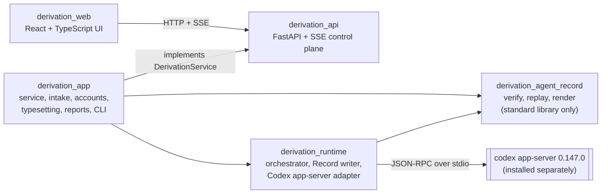

# DerivationLab

DerivationLab runs physics derivations with language models and keeps an
account of them that anyone can check. A Writer model proposes the derivation
step by step, a Checker model examines each sealed step, a Judge model gives a
verdict on a finished route, and a person can pause, redirect or revise the
work at any point. Every step revision, check, judgement and human action, and
every model call of the derivation, is an event in one append-only JSONL file,
each event hashed and linked to the one before it. That file, the Record, is
the only scientific truth: the tree the web UI shows, the canonical state and
the HTML audit view are all replays of it.

Two kinds of model call happen outside the Record, and neither changes it.
Problem Intake talks to a model before the run exists; the Record starts from
the confirmed problem, bound by its SHA-256 in the first event (the full
request is in the run's `manifest.json`). After a route finishes, a typeset
layer compiles its formulas and may ask fresh Writer and Checker threads to
repair ones that do not compile; those calls and their results are kept in a
separate hash-bound file under the run's `typeset/` directory, and the UI marks
every step whose math it shows from that layer.

This repository holds the whole system: the Record verifier, the derivation
runtime, the HTTP service, the web UI, the Record contract, and example records.

- **To check a record**, you need Python and nothing else. Start with
  [Verify a record yourself](#verify-a-record-yourself).
- **To run derivations**, you need the Codex CLI at exactly version 0.147.0 and
  your own ChatGPT sign-in; there is no API-key path yet. See
  [Run DerivationLab locally](#run-derivationlab-locally).

There are no benchmark numbers or results tables here.

## Verify a record yourself

No install, no dependencies, no network. Python 3.9 or newer and a clone:

```console
$ git clone https://github.com/Material-Intelligence/derivationlab
$ cd derivationlab
$ export PYTHONPATH=src

$ python3 -m derivation_agent_record verify examples/runs/deterministic_fixture/events.jsonl
ok: 51 events, 2 branches, 2 candidates, 2 judgements

$ python3 -m derivation_agent_record render examples/runs/deterministic_fixture/events.jsonl \
      --output /tmp/viewer.html
$ open /tmp/viewer.html          # xdg-open on Linux
```

`verify` replays the record from scratch and exits 0 on a sound record, 2 on a
contract violation and 3 when it cannot read the file. `render` replays first,
then writes one self-contained HTML page: no script, no stylesheet link, no web
font, no image, no external URL. It opens from `file://` with the network off.
`replay EVENTS --output FILE` writes the canonical state as JSON, and `build`
writes both. From Python:

```python
from derivation_agent_record import load_events, replay_events, render_html

result = replay_events(load_events("examples/runs/deterministic_fixture/events.jsonl"))
print(result.canonical["summary"])   # raises ContractError first if the record is unsound
html = render_html(result)
```

`pip install .` installs the same package as the `derivationlab-record`
distribution, with a `derivationlab-record` console script. It is the only part
of the repository that is packaged; it imports nothing outside the standard
library, so that a record stays checkable on a machine with no network and no
wheels.

### Change one byte

```console
$ cp examples/runs/deterministic_fixture/events.jsonl /tmp/tampered.jsonl
$ python3 - <<'PY'
from pathlib import Path
p = Path("/tmp/tampered.jsonl")
b = p.read_bytes()
i = b.index(b"x^3")          # the frozen problem text in event 2's payload
p.write_bytes(b[:i + 2] + b"4" + b[i + 3:])   # x^3 -> x^4, same length
PY

$ python3 -m derivation_agent_record verify /tmp/tampered.jsonl
contract error: event 2: event_sha256 mismatch
```

Repair that digest and the next event's `prev_event_sha256` fails instead;
re-hash the whole chain and the cross-event rules still have to hold. The test
suite has both kinds: records with a stale digest, and records re-hashed so that
every digest agrees but a check, candidate or judgement breaks a rule, which a
hash chain alone would accept.

### Stability

The stable Python surface is four names: `load_events`, `replay_events`,
`render_html` and `ContractError` (`derivation_agent_record.__all__`).
Everything else in the package is importable but may change without notice.
The command-line exit codes are stable too: 0 for a sound record, 2 for a
contract violation, 3 for a file that cannot be read.

### The contract

The Record contract is [`docs/RECORD_SPEC.md`](docs/RECORD_SPEC.md), every
event type with its required fields is in
[`docs/EVENT_VOCABULARY.md`](docs/EVENT_VOCABULARY.md), and the JSON schemas
are in [`docs/spec/`](docs/spec) (v1) and
[`src/derivation_agent_record/schemas/`](src/derivation_agent_record/schemas)
(v1.1). The runtime hashes the contract document into the first event of every
record it writes; those documents are in Chinese and ship untranslated next to
the English translation, because only those bytes match the pinned digest
([`docs/spec/README.md`](docs/spec/README.md)).
`python3 tools/verify_record_pins.py` checks every example record's pins.

### Example records

| Record | What it is | Read it as |
|---|---|---|
| [`deterministic_fixture/`](examples/runs/deterministic_fixture) | Record v1, 51 events, 2 branches, 10 model calls, 4 checks, 2 candidates, 2 judgements | **No model was called.** A deterministic stand-in runtime, recorded exactly as a real run would be. The problem is differentiating `x^3 + sin(x)`. Evidence about the record format only. Produced by this repository's fake service; `code_commit` is a zero placeholder. |
| [`uniformly_charged_sphere/`](examples/runs/uniformly_charged_sphere) | Record v1, 35 events, 1 branch, 3 step revisions, 7 model calls, 3 checks, 1 candidate, 1 judgement | **A real model run, closed book**: `gpt-5.6-sol` through `codex-app-server` 0.147.0 derives the field of a uniformly charged sphere; checks `ok`, judgement `pass`. Writer, checker and judge are the same model; Maxwell's equations and the divergence and uniqueness theorems are admitted as primitives; two earlier attempts failed and are not shipped. Its `code_commit` names the development commit that produced it, which is not in this repository's history. |
| [`worked_v1_1/`](examples/runs/worked_v1_1) | Record v1.1, 48 events, 21 of the 22 event types | **Synthetic.** Written from the contract by [`tests/v1_1_example.py`](tests/v1_1_example.py), not captured from a run; the suite pins the file to the builder. |

[`examples/runs/README.md`](examples/runs/README.md) explains every field that
looks odd. None of the records contains `source_evidence_registered`, the event
that puts third-party source text inside the hash chain, where it can never be
removed again.

## Run DerivationLab locally

### What a run needs

- **macOS on Apple silicon (`darwin-arm64`).** Derivation runs and PDF
  reporting are supported there only, today. The formula checker's engine
  whitelist (`src/derivation_runtime/formula_engine_whitelist.json`) was
  generated on `darwin-arm64`, and on any other platform the check fails closed
  (`engine whitelist was generated on darwin-arm64, not on the running
  platform ...`), so runs, and much of the service's test suite, stop there.
  The launch gate's sandbox evidence is also for macOS only
  (`src/derivation_runtime/platform_evidence/`).
- **Codex CLI, exactly 0.147.0**, as `codex` on `PATH` or passed with
  `--codex-executable` (`npm install -g @openai/codex@0.147.0`).
  DerivationLab drives the official `codex app-server` over stdio and refuses
  any other version, because its protocol boundary is pinned to that release:
  it runs `codex --version` first, and startup stops with `Codex 0.147.0 is
  required; found X at PATH` (exit code 2), which `doctor` also reports.
- **Your own ChatGPT sign-in.** The product signs in through the app-server's
  device-code login (from the web UI), or imports an existing Codex CLI ChatGPT
  login. Runs use that account's plan and usage limits. The credential stays in
  a private profile directory (`CODEX_HOME/auth.json`, mode 0600) and is never
  copied into a run, a record, a manifest or a log. `OPENAI_API_KEY` is
  deliberately not used: the app-server is launched with an environment that
  does not contain it. An API-key path is on the roadmap, not in the code.
- **uv** and Python 3.13 or 3.14 for the service (`src/derivation_api/`
  pins 3.14). On first start the product also creates, with uv, the SymPy
  environment the model's compute tool uses, from a hash-pinned lock; that
  needs the network once.
- **Node.js 22.18 or newer, and npm**, to build the web UI.
- **A git clone**, not a ZIP download. Every run records `git rev-parse HEAD`
  as its code commit, and the service refuses to start where it cannot.
- **PDF reports are optional** and need a separate provisioning step that is
  pinned for macOS on Apple silicon only (see [PDF reports](#pdf-reports)).
  Without it, PDF export and the typeset layer's compile-and-repair step are
  unavailable (they fail closed); derivation runs, checks, judgements and the
  Record are unaffected.

### Install

```console
$ git clone https://github.com/Material-Intelligence/derivationlab
$ cd derivationlab
$ uv sync --frozen --project src/derivation_api
$ (cd src/derivation_web && npm ci && npm run build)
```

All commands below run from the repository root with:

```console
$ export PYTHONPATH=src:src/derivation_api PYTHONDONTWRITEBYTECODE=1
```

### Try it with no model: the development server

```console
$ uv run --frozen --project src/derivation_api python -m derivation_app \
      dev --fake --run-root runs/derivation-app-dev --web-dist src/derivation_web/dist
```

Open <http://127.0.0.1:8000/>. Behind this server is a deterministic runtime
that calls no model and needs no sign-in; it exists to exercise the service and
the UI, and it labels everything it records as `deterministic-fake-runtime`.
For UI work with hot reload, run `npm run dev` in `src/derivation_web` with
`VITE_API_BASE_URL=http://127.0.0.1:8000`, or with `VITE_API_MODE=fixture` to
use built-in example data and no backend at all.

### Start the product

```console
$ uv run --frozen --project src/derivation_api python -m derivation_app
$ uv run --frozen --project src/derivation_api python -m derivation_app doctor
```

The first command creates the private product profile (in the platform's application-data directory,
outside the repository), mounts the built UI, and serves it on
<http://127.0.0.1:8000/>. The server binds loopback only. In the UI: sign in,
describe a problem (Problem Intake turns it into a confirmed specification over
a few rounds), start the run, and follow the tree as it grows. Each run's
Record is written under the product's run directory and can be checked with
`python3 -m derivation_agent_record verify` like the examples above.

`doctor` runs local checks (the product profile, the SymPy environment, the
ChatGPT credential, the Codex executable and its version, the web bundle) and
makes no model call. Run it after the first start: before that, the product
profile does not exist yet and `doctor` reports it missing.

`python -m derivation_app --help` lists the other options, including the
multi-user `server` mode, which this README does not cover.

### PDF reports

A run's report can be exported as TeX and PDF. The PDF is compiled by Tectonic
0.17.0 with a pinned TeX bundle, inside a sandbox with the network denied.
Tectonic and the bundle are third-party software under several licences, so
they are not in this repository. Fetch and verify them with:

```console
$ python3 tools/provision_tectonic.py           # about 70 MB; a few minutes
$ python3 tools/provision_tectonic.py --check   # verify an install, no network
```

The script checks the release archive, the binary and every one of the 332
bundle files against [`config/reporting/`](config/reporting), and installs
nothing unless all of them match. The Fandol fonts come from the frozen TeX
Live 2025 archives first and from CTAN after that; a source that fails, for a
network or certificate reason, is skipped. Only `darwin-arm64` is pinned. On
any other platform it says so and exits; PDF export there fails closed with
`tectonic_runtime_unavailable`. `--from DIR` installs from a local copy, for a
machine without network access or when a download host is down: run the
script on a second machine and copy its
`src/derivation_app/resources/reporting/runtime/` directory over.

## Architecture



The orchestrator in `derivation_runtime` talks to models only through the
`ModelRuntime` protocol, and the one implementation today is the Codex
app-server adapter. `derivation_agent_record` reads what the runtime writes and
depends on nothing. Two imports run against the arrows, both inside a function:
the runtime reads the report preamble from `derivation_app`, and the API's
demo service reads the model catalog and the problem presets from it.
[`docs/ARCHITECTURE.md`](docs/ARCHITECTURE.md) walks through each package.

```text
src/derivation_agent_record/   verifier, replay, renderer (stdlib only; the packaged part)
src/derivation_runtime/        orchestrator, Record writer, Codex app-server adapter
src/derivation_api/            FastAPI app, request/response models, openapi.json
src/derivation_app/            product service, intake, accounts, typesetting, reports, CLI
src/derivation_web/            React UI
docs/                          the Record contract, event vocabulary, architecture
examples/runs/                 three example records with captions
config/reporting/              Tectonic pins (lock and bundle manifest)
tools/                         release scanner, pin checker, Tectonic provisioning
tests/                         Record contract suite and tooling tests
```

## Testing

```console
# Record verifier and repository tooling: standard library plus pytest
$ python3 -m unittest derivation_agent_record.selftest     # with PYTHONPATH=src
$ python3 -m pytest

# Runtime, service, API and the formula whitelist generator
$ PYTHONPATH=src:src/derivation_api uv run --frozen --project src/derivation_api \
      pytest -q --import-mode=importlib src/derivation_app/tests src/derivation_api/tests \
      src/derivation_runtime tools/formula_whitelist/tests

# Web UI
$ cd src/derivation_web && npm test && npm run api:check && npm run typecheck && npm run lint

# Release gates and record pins
$ python3 tools/release_check.py
$ python3 tools/verify_record_pins.py
```

No test calls a model. Without a provisioned Tectonic, the tests that compile
real TeX are skipped with a reason. The source-pack rules are tested against a
self-written stand-in pack. Off `darwin-arm64` the runtime and service suite
stops at collection by design: the formula engine whitelist refuses to load on
a platform it was not generated on. CI runs all of the above on every push
([`.github/workflows/ci.yml`](.github/workflows/ci.yml)).

## Limitations

- **One model backend.** Runs go through the Codex app-server with a ChatGPT
  sign-in. There is no API-key adapter, and no other provider.
- **One Codex version.** Exactly 0.147.0. A newer Codex CLI is refused until
  the protocol boundary is re-pinned and re-tested.
- **One platform.** Derivation runs and PDF reporting are supported on
  `darwin-arm64` only. Other platforms fail closed at the formula-engine
  whitelist check, sandbox conformance evidence exists for macOS only, and the
  PDF runtime is pinned for `darwin-arm64` only. The whitelist generator is in
  [`tools/formula_whitelist/`](tools/formula_whitelist), but it compiles with
  the pinned Tectonic, so a new platform needs a Tectonic pin first
  ([`CONTRIBUTING.md`](CONTRIBUTING.md) has the steps). The record verifier
  depends on none of this: it is standard-library Python.
- **Closed book.** The code for hash-bound literature packs exists, but no pack
  ships and the service refuses runs that ask for one, so runs cannot cite
  sources. There are no built-in problem presets.
- **One real-model example.** The other two example records are a
  deterministic fixture and a synthetic record.
- **Layering is not strict.** See the two function-local imports under
  [Architecture](#architecture).

## Roadmap

- A `ModelRuntime` adapter that calls a model API with the user's own key.
- Runs and PDF reporting on platforms other than `darwin-arm64`: pinned
  Tectonic binaries for them in `config/reporting/tectonic_runtime.lock.json`,
  and a formula engine whitelist generated on each with
  `tools/formula_whitelist/generate.py`.
- Platform conformance evidence for Linux.
- More real-model example records, each with a caption like the one above.

## Contributing and security

The most useful contribution is a record the verifier judges wrongly;
[`CONTRIBUTING.md`](CONTRIBUTING.md) says how to send one and how to run each
part of the test suite. A record that verifies but should not, or a way to get
a credential out of the product profile, is a security report:
[`SECURITY.md`](SECURITY.md).

## Citing

[`CITATION.cff`](CITATION.cff) carries the machine-readable form; GitHub's
"Cite this repository" reads it.

## Licence

Code: Apache License 2.0; see [`LICENSE`](LICENSE) and [`NOTICE`](NOTICE),
which lists the third-party packages the build installs and what this
repository deliberately does not redistribute. Run records under
`examples/runs/` are data and are released under
[CC-BY 4.0](https://creativecommons.org/licenses/by/4.0/); attribute them to
Jiahao Xie.
