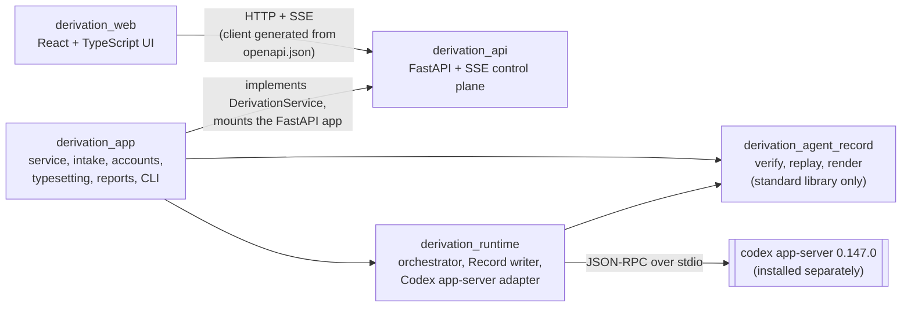

# Architecture

DerivationLab runs a derivation as a tree of branches. A Writer model proposes
steps, a Checker model examines each sealed step, a Judge model gives a verdict
on a finished route, and a human can pause, redirect or revise at any point.
Everything that happens in the derivation, every model call included, is
written to one append-only, hash-chained event log, the Record. The Record is
the only scientific truth: the tree the UI shows, the canonical state and the
HTML audit view are all replays of it. Two kinds of model call are outside it,
and neither changes it: Problem Intake runs before the run exists (the Record
binds the confirmed problem by its SHA-256 in its first event; the request is in
the run's `manifest.json`), and the typeset layer's formula repairs run after a
route finishes (see `route_typeset.py` below).

This document describes the code as it is. Paths are relative to the
repository root.

## The five packages

An arrow means "imports" (or, for the two outer arrows, "talks to"). The
direction is the one you would expect, with two exceptions, both of them
imports inside a function rather than at module level:

- `src/derivation_runtime/formula_validation.py` imports
  `REPORT_TEX_PREAMBLE` from `derivation_app.reporting`, so that formula
  diagnostics compile against the same preamble as the PDF report.
- `src/derivation_api/derivation_api/fake_service.py` imports the model catalog
  and the (empty) problem presets from `derivation_app`, for its deterministic
  demo service.

So `derivation_runtime` and `derivation_api` do not import cleanly on their
own without `derivation_app` next to them. That is recorded here rather than
claimed away.

| Package | Where | Depends on | Tests |
|---|---|---|---|
| `derivation_agent_record` | `src/derivation_agent_record/` | Python standard library | `tests/`, `python -m unittest derivation_agent_record.selftest` |
| `derivation_runtime` | `src/derivation_runtime/` | the record package; the `codex` executable at run time | `src/derivation_runtime/test_*.py` |
| `derivation_api` | `src/derivation_api/` (own `pyproject.toml`, `uv.lock`) | FastAPI, Starlette, Uvicorn, Pydantic, argon2-cffi, zxcvbn | `src/derivation_api/tests/` |
| `derivation_app` | `src/derivation_app/` | the three packages above; runs with the API project's environment | `src/derivation_app/tests/` |
| `derivation_web` | `src/derivation_web/` (own `package.json`) | React 19, KaTeX, zod, react-markdown; Vite and Vitest to build and test | `src/derivation_web/src/**/*.test.ts(x)` |

## derivation_agent_record: the verifier

The contract is in [`RECORD_SPEC.md`](RECORD_SPEC.md). This package is the part
of the system that has to stay trustworthy when everything else changes, so it
imports nothing outside the standard library and is published on its own as
the `derivationlab-record` distribution (the root `pyproject.toml`).

- `model.py`: canonical JSON, the event hash, constants shared by both Record
  generations.
- `replay.py`: `ReplayEngine` re-derives the whole run from the events and
  rejects any record whose chain or cross-event rules do not hold.
- `macro_expansion.py`: independent check of a recorded `macro_expansion`
  normalisation (Record 1.1).
- `render.py`: one self-contained HTML page per verified record; no script,
  stylesheet link, font or URL.
- `cli.py`: `verify`, `replay`, `render`, `build`.

The runtime writes records; this package only reads them. A record written by
the runtime is replayed by this package before the service shows it.

## derivation_runtime: the engine

- `types.py` defines the provider-neutral contracts. `ModelRuntime` is the seam
  between the engine and any model provider: start and collect a Writer,
  Checker or Judge call, fork a session, rehydrate a branch, interrupt,
  reconcile after a restart.
- `orchestrator.py`: `DerivationOrchestrator` drives the tree: branches, step
  sealing, checks, candidates, judgements, the model-call budget, pause,
  resume and human actions. It knows nothing about the provider.
- `record.py`: `RecordV1Writer` appends events (Record v1 and 1.1) and validates
  every transition before writing.
- `app_server_runtime.py`, `app_server_client.py`, `app_server_protocol.py`:
  `CodexAppServerRuntime` implements `ModelRuntime` over the official Codex
  app-server, spoken as JSON-RPC over the child's stdio. The protocol boundary
  is strict and pinned to Codex CLI 0.147.0; the generated protocol schema the
  tests check against is `protocol_schema/codex_app_server_protocol.v2.schemas.json`.
- `launch_gate.py`, `platform_policy.py`: check, before any model turn, that the
  executable, its version, its configuration and the platform's sandbox
  evidence match what is pinned, and report every mismatch as a gate issue. The
  only platform evidence shipped is for macOS (`platform_evidence/`). Two of
  the macOS host's four evidence items in `platform_report.current.json` are
  development runs that are not in this repository; they are listed by digest
  only, with `"published": false`.
- `prompts.py`: the Writer, Checker and Judge prompts and their JSON output
  schemas, kept in one place so they can be audited.
- `formula_normalization.py`, `formula_validation.py`: the reversible
  normalisation of a Writer's TeX and the conservative diagnostics behind it.
- `scientific_runtime.py`: provisions the pinned SymPy environment the model's
  compute tool uses (`scientific_runtime_requirements.lock`).
- `fake.py`: a deterministic `ModelRuntime` with no model behind it, used by the
  tests and by `dev --fake`.
- `source_material.py`: hash-bound literature snapshots. The code is here, but
  this repository ships no source pack and its pack allowlist
  (`METHOD_PACK_INPUTS`) is empty, so every pack is refused, and the service
  refuses a run that asks for one (see Limitations in the README). The tests
  exercise the pack rules against a self-written stand-in pack.
- `capabilities.py`: the capability profiles a run is created under.
  `source_reading_v1` is the tool-enabled Record 1.1 profile (the source and
  transcript reading tools, with an empty source library in this build);
  `benchmark_symbolic_v1` is the closed-book profile every shipped example uses.

There is one runtime adapter, `CodexAppServerRuntime`. A second adapter, for
example one that calls a model API with a key, would implement `ModelRuntime`
and leave the orchestrator and the Record unchanged. It does not exist yet.

## derivation_api: the HTTP contract

- `models.py`: the request and response models. `openapi.json` is generated from
  them and checked in; the web client is generated from that file, and
  `src/derivation_api/tests/test_openapi.py` fails if the two drift.
- `application.py`: `create_app` builds the FastAPI application around any
  object that implements the `DerivationService` protocol (`service.py`). No
  runtime is hidden in the handlers.
- `sse.py`: the event stream a running derivation pushes to the UI.
- `middleware.py`: the local-only boundary (loopback host and origin checks),
  and the exact-origin check of the multi-user server mode.
- `fake_service.py`: a hermetic service for transport tests and UI work.

## derivation_app: the product

- `service.py`: `RuntimeDerivationService` implements `DerivationService` over
  the orchestrator. It creates runs, pins the contract documents into each
  Record (by path and SHA-256, see `docs/spec/README.md`), and serves the run
  catalog, which lists a stored run only after a strict replay succeeds.
- `projection.py`: turns a replayed Record into the view models the UI renders.
- `intake_session.py`, `intake_session_service.py`,
  `app_server_intake_session.py`: Problem Intake, a persistent multi-round
  conversation that turns a user's question into a confirmed problem
  specification before any derivation starts.
- `product_profile.py`, `account.py`: a private profile directory (its own
  `HOME` and `CODEX_HOME`) and the ChatGPT sign-in, done through the app-server's
  device-code login. The credential stays in that profile and is never copied
  into a run, a Record, a manifest or a log.
- `route_typeset.py`, `typeset_archive.py`, `formula_compiler.py`: a typeset
  layer beside the Record that compiles every formula of a finished route and,
  where a formula fails, asks a fresh Writer thread for corrected LaTeX (and a
  fresh Checker thread when the correction is more than syntax). Those model
  calls are not Record events: they and their results are kept in a hash-bound
  file under `<run>/typeset/`, used only while its hashes match the Record. The
  Record itself is never changed, and the UI marks every step whose math it
  shows from this layer (`StepView.typeset`). Without a provisioned Tectonic
  the layer has no compiler and fails closed.
- `reporting.py`: the ReportBundle (TeX and PDF) of a run, compiled by a pinned
  Tectonic in a sandbox with the network denied. Without a provisioned runtime
  it fails closed with `tectonic_runtime_unavailable`.
- `site_identity.py`, `tenant_runtime.py`, `tenant_content.py`: the optional
  multi-user `server` mode, with website accounts and one isolated service per
  user.
- `problem_sources.py`: where a run's problem comes from. In this repository a
  run carries no literature pack and there are no built-in problem presets.
- `__main__.py`: the command line. No subcommand starts the product on
  loopback; `doctor` runs local checks with no model call; `dev --fake` starts
  the deterministic development server; `server` and `server-admin` run and
  administer the multi-user mode.

## derivation_web: the UI

A React 19 and TypeScript single-page app, built with Vite. The typed client in
`src/derivation_web/src/api/generated/` is generated from `src/derivation_api/openapi.json`
(`npm run api:generate`; `npm run api:check` fails on drift). The tree canvas
shows the whole derivation; the route reader renders one route as a continuous
document with KaTeX. English is the default locale and a complete Simplified
Chinese catalog ships alongside it. `VITE_API_MODE=fixture` runs the UI against
built-in example data with no backend.

## Where a run's files live

- `runs/<run_id>/` under the run root: `events.jsonl` (the Record), a
  `manifest.json` sidecar, `control.sqlite` bookmarks for resume, and the
  typeset layer.
- `<product profile>/workspaces/<run_id>/`: the app-server's working directory
  for the run.

The product's default run root and profile are in the platform's application
data directory, outside the repository. `runs/` in the repository is scratch
space for tests and the development server, and is ignored by git.
